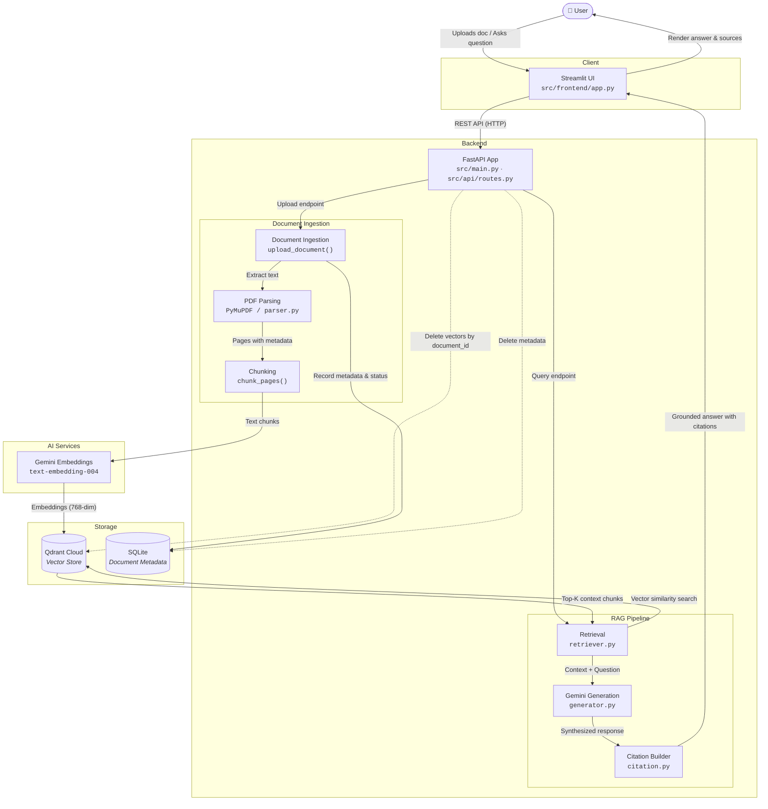

# InsightOS: Grounded Multimodal Knowledge & RAG System

InsightOS was built as a hands-on, practical way to understand how a complete Retrieval-Augmented Generation (RAG) system works end-to-end without relying on black-box orchestration frameworks like LangChain or LlamaIndex.

Documents are parsed and split into structured chunks, embedded using Google Gemini, stored and indexed in Qdrant Cloud, and retrieved with semantic similarity search when a user asks a question. Every answer is strictly grounded in the retrieved context with verifiable, page-level citations.

---

## Architecture Diagram



---

## How InsightOS Works

InsightOS operates through five core sub-systems:

### 1. Document Ingestion & Parsing
- When a user uploads a PDF, text, or markdown file through the Streamlit interface, it is sent to `POST /api/v1/documents/upload`.
- The parser (`src/services/ingestion/parser.py`) extracts text page-by-page using PyMuPDF (`fitz`), preserving structural page numbers.
- The chunker (`src/services/ingestion/chunker.py`) splits page text into configurable segments (500 characters with 50-character sliding overlap) while attaching immutable metadata (`document_id`, `page_number`, `chunk_index`, `source_location`).
- Document status (`pending`, `indexed`, `failed`) and chunk counts are tracked in SQLite via SQLAlchemy.

### 2. Embedding & Vector Storage
- Chunks are vectorized using Google Gemini's `text-embedding-004` model via `src/services/embeddings/provider.py`.
- Vectors (768 dimensions) are upserted into Qdrant Cloud (`src/services/vector_store/qdrant.py`) with payload filters for `document_id`.
- Cosine distance is used as the similarity metric.

### 3. Semantic Retrieval & Grounded Synthesis
- When the user asks a question, the query is embedded and sent to Qdrant Cloud to fetch the top-$K$ most relevant chunks.
- The RAG orchestrator (`src/services/rag/orchestrator.py`) compiles retrieved snippets into a strictly-bounded context prompt.
- Gemini 2.5 Flash generates a direct response. If the retrieved documents do not contain enough information to answer the question, the system returns a deterministic fallback message rather than hallucinating.

### 4. Citation Resolution & Source Verification
- The citation resolver (`src/services/rag/citation.py`) detects citation markers in the LLM output and maps them back to the exact source chunk, document name, and page number.
- In the Streamlit UI, users can expand citations to inspect the raw excerpt that supported each claim.

### 5. Document Management & Deletion
- Users can view all indexed documents in the sidebar Document Library.
- Deleting a document removes its metadata record from SQLite and triggers a payload-filtered vector purge in Qdrant Cloud.

---

## Repository Structure

```
InsightOS/
│
├── src/
│   ├── api/
│   │   ├── __init__.py
│   │   └── routes.py              # FastAPI REST endpoints (/upload, /query, /documents)
│   ├── core/
│   │   ├── __init__.py
│   │   ├── config.py              # Pydantic Settings & environment variables
│   │   ├── database.py            # SQLAlchemy database engine and session factory
│   │   └── exceptions.py          # Custom domain exception hierarchy
│   ├── frontend/
│   │   ├── __init__.py
│   │   ├── api_client.py          # Backend HTTP client wrapper
│   │   └── app.py                 # Streamlit UI dashboard & chat interface
│   ├── models/
│   │   ├── __init__.py
│   │   ├── db_models.py           # SQLAlchemy ORM models (Document, Chunk)
│   │   └── schemas.py             # Pydantic request & response schemas
│   ├── services/
│   │   ├── __init__.py
│   │   ├── embeddings/
│   │   │   ├── __init__.py
│   │   │   └── provider.py        # Gemini embedding provider implementation
│   │   ├── ingestion/
│   │   │   ├── __init__.py
│   │   │   ├── chunker.py         # Text chunking with sliding window overlap
│   │   │   └── parser.py          # PDF/Text extraction with PyMuPDF
│   │   ├── rag/
│   │   │   ├── __init__.py
│   │   │   ├── citation.py        # Citation mapper & source resolver
│   │   │   ├── generator.py       # Gemini grounded generation client
│   │   │   ├── orchestrator.py    # End-to-end RAG workflow orchestrator
│   │   └── retriever.py           # Semantic vector retrieval service
│   │   └── vector_store/
│   │       ├── __init__.py
│   │       ├── provider.py        # Vector store interface definition
│   │       └── qdrant.py          # Qdrant Cloud client wrapper & collection management
│   └── main.py                    # FastAPI application initialization & lifecycle
│
├── tests/
│   ├── integration/
│   │   ├── __init__.py
│   │   ├── test_retrieval_integration.py     # Live API integration tests (Qdrant & Gemini)
│   │   └── test_streamlit_browser_e2e.py     # Playwright E2E browser automation tests
│   └── unit/
│       ├── __init__.py
│       ├── test_api.py            # REST endpoint unit tests
│       ├── test_chunker.py        # Chunking boundary & overlap tests
│       ├── test_citation.py       # Citation mapping tests
│       ├── test_config.py         # Configuration loading tests
│       ├── test_database.py       # SQLAlchemy SQLite repository tests
│       ├── test_embeddings.py     # Embedding provider mock & edge case tests
│       ├── test_frontend.py       # Frontend API client tests
│       ├── test_generator.py      # LLM generator tests
│       ├── test_models.py         # Pydantic schema validation tests
│       ├── test_orchestrator.py   # RAG pipeline orchestration tests
│       ├── test_parser.py         # PyMuPDF parser tests
│       ├── test_retriever.py      # Semantic retriever tests
│       └── test_vector_store.py   # Qdrant vector store unit & integration tests
│
├── .gitignore                     # Git ignore rules (.env, *.db, *.png, etc.)
├── pyproject.toml                 # Project metadata, dependencies, and tools
├── README.md                      # Project documentation and architecture guide
└── uv.lock                        # Lockfile for reproducible dependencies
```

---

## Technology Stack

| Layer | Technology | Purpose |
|---|---|---|
| **API Framework** | FastAPI | REST API endpoints for ingestion, query, and document management |
| **Frontend UI** | Streamlit | Web interface for file upload, document library, and chat interaction |
| **Embeddings** | Google Gemini `text-embedding-004` | 768-dimensional semantic text embeddings |
| **LLM Generation** | Google Gemini `gemini-2.5-flash` | Grounded answer generation and context synthesis |
| **Vector Database** | Qdrant Cloud | Remote vector indexing, cosine search, and payload filtering |
| **Document Parsing** | PyMuPDF (`pymupdf`) | Fast, accurate PDF text extraction with page metadata |
| **Metadata DB** | SQLite + SQLAlchemy | Document tracking, chunk counts, and status persistence |
| **Browser Testing** | Playwright | Headless Chromium end-to-end browser verification |
| **Package Manager** | `uv` / `pip` | Fast Python dependency management |

---

## Setup & Running Locally

### 1. Prerequisites
- Python 3.11+
- A Google Gemini API key ([Google AI Studio](https://aistudio.google.com/))
- A Qdrant Cloud cluster and API key ([Qdrant Cloud](https://cloud.qdrant.io/))

### 2. Installation
Clone the repository and install dependencies inside a virtual environment:
```bash
# Using uv (recommended)
uv venv
.venv\Scripts\activate      # Windows
source .venv/bin/activate    # Linux / macOS
uv pip install -e .

# Or using standard pip
python -m venv .venv
.venv\Scripts\activate      # Windows
source .venv/bin/activate    # Linux / macOS
pip install -e .
```

Install Playwright browser binaries (for E2E browser tests):
```bash
playwright install chromium
```

### 3. Environment Configuration
Create a `.env` file in the project root:
```env
# Database Settings
SQLITE_DB_URL="sqlite:///./insightos.db"

# API Keys & Endpoints (Never commit .env to GitHub)
GEMINI_API_KEY="your-gemini-api-key"
QDRANT_API_KEY="your-qdrant-api-key"
QDRANT_URL="https://your-cluster-id.eu-west-2-0.aws.cloud.qdrant.io"

# Optional Model Overrides
LLM_MODEL="gemini-2.5-flash"
EMBEDDING_MODEL="text-embedding-004"
```

### 4. Running the Application

**Step 1: Start the FastAPI Backend**
```bash
.venv\Scripts\python.exe -m uvicorn src.main:app --port 8000 --reload
```
Backend health check: `http://127.0.0.1:8000/health`  
Interactive API Docs (Swagger): `http://127.0.0.1:8000/docs`

**Step 2: Start the Streamlit Frontend**
In a separate terminal:
```bash
.venv\Scripts\python.exe -m streamlit run src/frontend/app.py
```
Open `http://127.0.0.1:8501` in your browser.

---

## Running Tests

InsightOS includes a test suite covering unit tests, live integration tests, and Playwright browser E2E tests.

```bash
# Run all tests (183 items)
.venv\Scripts\python.exe -m pytest

# Run unit tests only (fast, no external API calls)
.venv\Scripts\python.exe -m pytest tests/unit/

# Run live API integration tests (requires valid .env)
.venv\Scripts\python.exe -m pytest tests/integration/test_retrieval_integration.py

# Run Playwright browser E2E tests
.venv\Scripts\python.exe -m pytest tests/integration/test_streamlit_browser_e2e.py
```

---

## Key Implementation Details

1. **Explicit RAG Pipeline:** We intentionally avoid high-level RAG frameworks to maintain full control over chunking strategies, vector payload schema, retrieval scoring, and prompt bounding.
2. **Payload Indexing in Qdrant:** Qdrant Cloud requires a payload index on filtered attributes like `document_id`. The client automatically verifies and creates the keyword payload index upon collection initialization.
3. **Deterministic Citations:** Citations are not generic web links; they are resolved directly against the retrieved chunk IDs and source page numbers returned by Qdrant.
4. **Grounding Fallback:** When retrieved chunks do not contain sufficient context, the generator returns a standard fallback message to prevent hallucinations.
